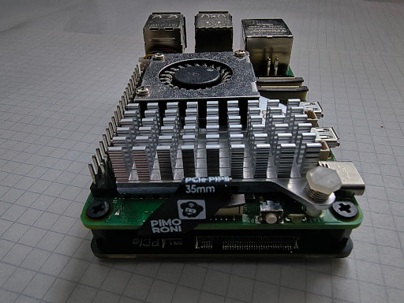
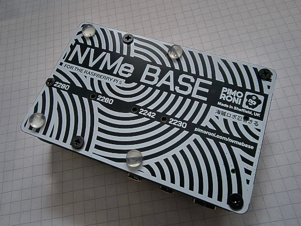
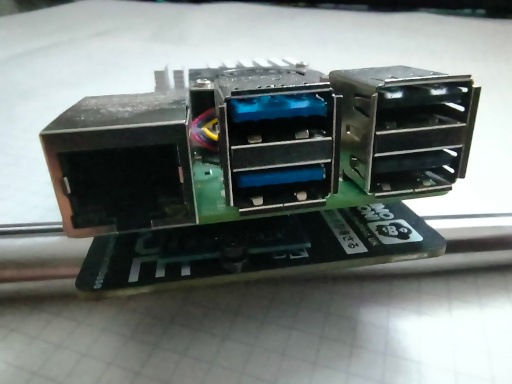

This post provides a brief overview of the hardware, installation methods, and software configuration used in my home Kubernetes lab.

# Hardware

The cluster currently consists of:

* `Odroid N2`
* `Odroid M2`
* `Raspberry Pi 5`
* `Raspberry Pi 500`
* `Orange Pi 5 Plus`

Among these devices, only the `Odroid N2` lacks an `M.2` interface for an `NVMe` SSD and must rely on an `SD` card for storage. All the others support `NVMe` drives — well, almost all of them, but we'll get to that in a moment.

I'm only interested in **2280** form-factor drives due to their lower cost and wider availability.

Let's take a quick look at what is required to use — and boot from — an `NVMe` drive on each platform.

## Raspberry Pi 5

The Raspberry Pi 5 supports `M.2 NVMe` storage through an additional PCIe expansion board (HAT). The best option in terms of price and quality is the one made by *Pimoroni*.

The Internet is full of installation guides, so I'll keep it brief. The process consists of:

* attaching the metal standoffs,
* mounting the SSD using the supplied screw,
* connecting the ribbon cable,
* attaching the HAT to the underside of the Raspberry Pi.

The SSD ends up hidden inside the assembly, between the Raspberry Pi 5 and the HAT itself.







### Operating System Installation

There are two ways to install the operating system: with or without an `SD` card. For the purposes of this project, we're only interested in `Ubuntu Server`.

#### Method 1

The first method is straightforward:

* write a standard `Raspberry Pi OS` image (or any other operating system) to an SD card and boot the Raspberry Pi,
* verify that the system can see the SSD:

```sh
$ lsblk | grep nvme0
```

The command should return something similar to:

```text
nvme0n1
```

Then:

* install and launch `rpi-imager`,
* select `Ubuntu Server` from the operating system list,
* choose the NVMe drive as the target device,
* start the image-writing process,
* shut down the Raspberry Pi,
* remove the SD card,
* boot the system again.

There is no need to modify the boot order and make NVMe booting the default. It's useful to retain the ability to boot from an SD card "just in case".

The Raspberry Pi will still boot from the NVMe drive automatically, albeit a few seconds later. Those extra seconds are hardly a problem.

#### Method 2

The second method requires an `M.2` to `USB` adapter.

In this case, the operating system image is written directly to the SSD before it is mounted onto the HAT.

Once installed, the Raspberry Pi boots exactly the same way as in the first method.

### Configuration

There are two things worth doing immediately after installation:

* disable swap,
* create a dedicated user account, grant passwordless `sudo` access, and exchange SSH keys.

You can verify whether swap is enabled using:

```bash
$ swapon --show
$ free -h
```

If swap is active, you'll likely see something similar to:

```text
NAME      TYPE SIZE USED PRIO
/swap.img file   8G   0B   -2
```

Disable swap immediately:

```bash
$ sudo swapoff -a
```

Then remove the corresponding entry from `/etc/fstab`, for example:

```text
/swap.img none swap sw 0 0
```

This prevents swap from being re-enabled after a reboot.

Creating a dedicated administrative user is equally simple. Assuming the new user is called `marcin`, add the following entry to `/etc/sudoers`:

```text
# marcins and others:
marcin ALL=(ALL) NOPASSWD:ALL
```

Finally, exchange SSH keys:

```bash
$ ssh-copy-id marcin@raspberry-pi-5-address
```

In my case:

```bash
$ ssh-copy-id marcin@10.10.10.21
$ ssh-copy-id marcin@10.10.10.26
```

With that done, the machine is ready for automation with tools such as Ansible.

In the next installment: **Odroid M2** — and there will be quite a bit to talk about.
