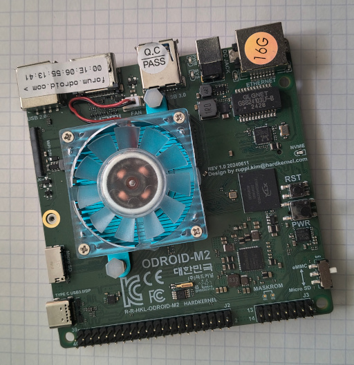
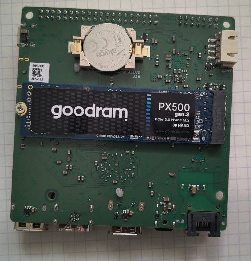
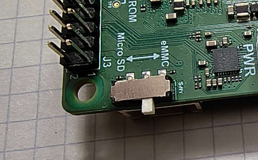

Continuation of the post [Hardware and Software (I)](/posts/2026-06-15)

# Odroid M2

The `Odroid M2` deserves a dedicated article, as installing and configuring the operating system requires a few extra steps and a fair amount of patience.



The board vendor seems particularly fond of shipping museum-grade software as officially supported images. Personally, I am not a fan of running `Ubuntu 20.04` with a `4.9` or `5.1` kernel in 2026. That is not exactly what modern workloads are looking for.

Instead, I strongly recommend using `Armbian`, whose developers release updates regularly. If you're impatient, you can always build your own image.

Unfortunately, after installing the official image on an SD card, it quickly becomes apparent that `Kubernetes` is not particularly happy with the default kernel configuration. The kernel is built with only a minimal set of features enabled, so it is time to roll up your sleeves and build a custom version.

## Storage

The `Odroid M2` provides an `M.2 NVMe` slot on the underside of the board, making SSD installation straightforward. Simply insert the drive, secure it using the supplied screw, and enjoy your new storage.



> **Important:** The board cannot boot directly from an NVMe SSD. You must use either an SD card or the built-in eMMC module for booting.

Take a close look at the connectors and switches on the board. One of them controls the SD/eMMC boot source selection. During installation and initial setup, leave it in the `Micro SD` position.



## Building the System

Additional requirements: two SD cards (assuming limited prior experience and the possibility of rebuilding the image later).

### Bootstrap

Start by installing the latest version of `Armbian` onto an SD card and booting from it.

Next:

* Complete the initial system configuration (passwords, user accounts, locale, and everything else the setup wizard asks for).
* Allow your user to execute `sudo` without a password by adding something similar to `/etc/sudoers`:

```text
marcin ALL=(ALL) NOPASSWD:ALL
```

* Install `git`.
* Clone the build repository:

```bash
git clone --depth 1 https://github.com/armbian/build
```

* Launch the main build script:

```bash
cd build
./compile.sh
```

The script handles the entire build process:

* installs missing dependencies,
* guides the user through the required configuration,
* downloads and builds the kernel,
* fetches all remaining packages,
* generates a complete system image.

### Configuration and Build

Important options in the configuration wizard:

* `Show a kernel configuration menu before compilation`

The default kernel configuration is generally reasonable, but it is worth verifying that options required by Kubernetes are enabled, particularly various `netfilter` features.

* `Choose a board` → **odroidm2**
* `Choose a kernel` → **current**
* `Choose a release package base` → **noble**

(`resolute` has recently appeared, but I have not tested it yet.)

* `Choose image type` → **Image with console interface**
* `Choose image type (II)` → **Standard image with console interface**

You may spend anywhere from a few minutes to several hours reviewing kernel options, which is why I recommend having a spare SD card available.

Once configuration is complete, the build system will spend quite some time compiling kernels, building packages, and assembling the final image.

During that time, you can:

* go for a run,
* visit the swimming pool,
* ride a bicycle,
* or, as a last resort, take a very long walk.

Once the build completes successfully, you should find something similar to the following in `output/images`:

```text
Armbian-unofficial_26.08.0-trunk_Odroidm2_resolute_current_6.18.35.img
```

Yes, every locally built image automatically receives the `-unofficial` suffix.

### Writing the Image

Since the device only provides a single SD card slot, you will need to transfer the generated image to your regular workstation and write it to the second SD card.

After that:

* shut down the device,
* replace the SD card,
* power it on,
* enjoy your shiny new system,
* go through the initial configuration one more time.

Make sure the SSD is visible:

```bash
lsblk | grep nvme0
```

The output should look similar to:

```text
nvme0n1
```

## Installing the System onto eMMC and NVMe

> Running from an SD card is useful for diagnostics and experimentation, but the built-in eMMC should be used for everyday operation.

To begin installation:

```bash
armbian-install
```

The most important choice during installation is:

```text
boot from eMMC, root from NVMe
```

The installer will warn about potential data loss, create fresh partitions on both eMMC and SSD storage, and transfer the already configured system onto the SSD.

As a result, you will not need to repeat the entire setup process again.

Once installation completes:

* shut down the device,
* remove the SD card,
* switch the boot selector to `eMMC`,
* power the board on,
* enjoy a significantly faster-booting `Odroid M2`.

## Final System Configuration

The first thing to do is disable swap.

Check whether swap is active:

```bash
swapon --show
free -h
```

Typical output:

```text
NAME      TYPE SIZE USED PRIO
/swap.img file   8G   0B   -2
```

Disable it completely:

```bash
sudo swapoff -a
```

If `swapon --show` reports something like:

```text
/dev/zram0
```

then zram should be disabled as well:

```bash
sudo systemctl disable --now armbian-zram-config
```

Optionally remove the configuration:

```bash
sudo rm -f /etc/default/armbian-zram-config
```

Kubernetes does not particularly appreciate active swap devices, so it is best to disable them before proceeding further.

Your user account probably no longer has passwordless sudo access, so repeat the same `sudoers` modification as before.

Finally, replace your SSH keys:

```bash
ssh-copy-id marcin@odroidm2
```

In my case:

```bash
ssh-copy-id marcin@10.10.10.24
```

Voilà. The system is now ready for the next stage.
