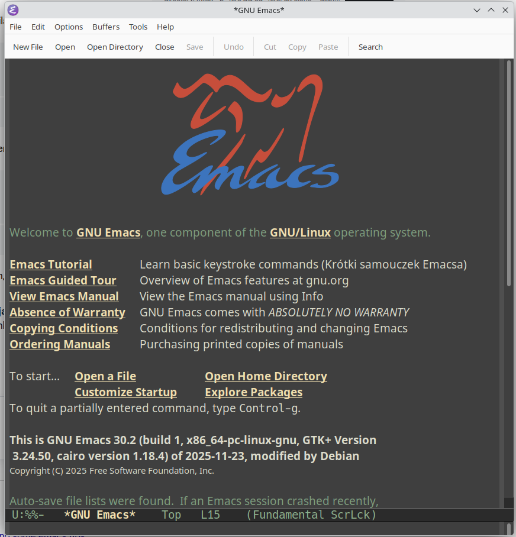
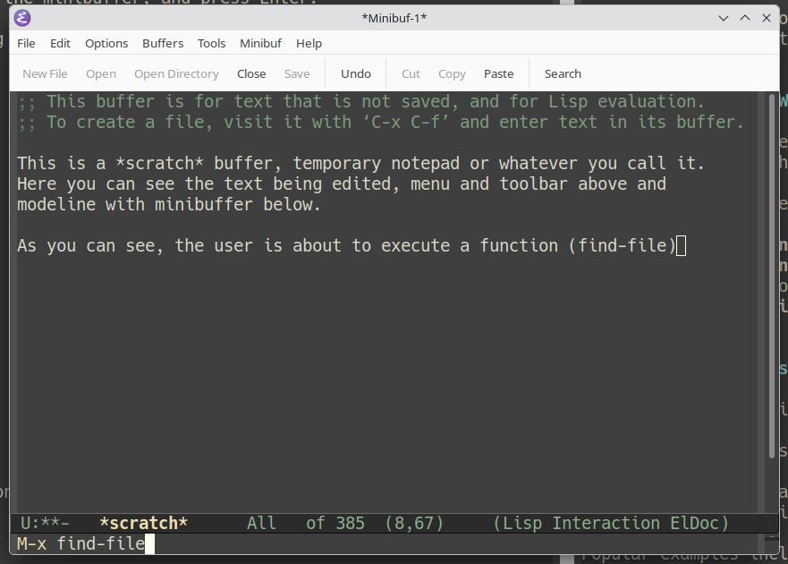

# Installation

There isn't much to say about installing Emacs.

* Every respectable Linux distribution includes Emacs in its package repositories. Simply use your distribution's package manager.
* The same is true for the BSD family.
* On macOS, you can install it using `Homebrew`, `MacPorts`, or download a native build from https://emacsformacosx.com/.
* On Windows, simply download the official installer (`.exe`) or the ZIP archive and extract it somewhere sensible.
* On Android, install the official `.apk` package and allow applications from unknown sources in the system settings.

> **A small note:** if you have no interest in running the graphical version, most Unix-like systems also provide an `emacs-nox` package.

Of course, you can always build Emacs from source.

But why would you, when you could spend that hour starting another flame war on Twitter (formerly "X"), Reddit, or simply improving your thumb's scrolling endurance on social media?

Personally, I'd rather spend that hour weeding the vegetable garden.

Usenet has long since passed into history, and no equally entertaining place for operating-system flame wars has ever truly replaced it.

# Getting Started

## Launching Emacs

Launching the Finest Editor Known to Humankind is surprisingly simple.

* On graphical desktops, Emacs should appear in your applications menu like any other program.
* On Windows, if you extracted the ZIP archive instead of running the installer, start `bin\runemacs.exe`.
* If you prefer a purely terminal-based experience, simply run:

```bash
emacs -nw
```

This is where the Emacs journey truly begins.

The first launch of an unmodified (_vanilla_) Emacs under X11, Windows, or macOS opens a window featuring the GNU antelope, a welcome screen, and a few introductory notes.

Curiously, what most desktop environments call a *window*, Emacs calls a **frame**.

The reason is historical.

Long before graphical user interfaces became commonplace, Emacs already knew how to divide a terminal screen into multiple independent editing areas called **windows**. When graphical support arrived, the terminology remained unchanged: the top-level GUI object became a *frame*, while the individual editing regions inside it continued to be called *windows*.

Some traditions are simply too old to change.



# Meet the Interface

A default Emacs frame consists of:

* a menu bar,
* a toolbar (whose appearance ranges from "functional" to "deeply unfortunate", although fortunately it can be hidden),
* one or more editing buffers,
* and the command line, better known as the **minibuffer**.

## Buffers

A **buffer** is the place where text is edited.

Unlike most editors, however, an Emacs buffer is not necessarily associated with a file.

Buffers may contain:

* source code,
* documentation,
* shell sessions,
* email,
* directory listings,
* Git status,
* help pages,
* or virtually anything else.

This abstraction is one of the core ideas behind Emacs.

Every buffer contains an editing area together with a **mode line**, which displays useful information such as:

* the buffer name,
* whether the buffer has unsaved changes,
* the current cursor position,
* and the active editing mode.

## Major Modes

Most editing behavior in Emacs is controlled by **major modes**.

A major mode typically corresponds to the type of document being edited.

Whether you're writing C code, XML, Markdown, Lisp, YAML, or something entirely your own, the selected mode determines:

* syntax highlighting,
* indentation rules,
* available commands,
* keyboard shortcuts,
* and countless editor behaviors.

Creating your own modes is also entirely possible, should inspiration strike.

## The Minibuffer

The **minibuffer** serves as the communication channel between Emacs and its user.

Emacs displays prompts and status messages there, while the user enters commands, filenames, search patterns, and countless other parameters.

The minibuffer supports:

* command history,
* TAB completion,
* and context-sensitive suggestions.

It may look like a single line of text, but it is one of the most heavily used parts of Emacs.

## Windows and Frames

A frame may be divided into multiple **windows**.

Each window displays a buffer.

Interestingly, multiple windows may display the very same buffer simultaneously, each with its own cursor position and viewport.

Only the minibuffer is shared across the entire frame.

# Keys and Commands

Emacs documentation uses a notation that initially looks mysterious but quickly becomes second nature.

The most common forms are:

* **C-x** — hold the **Control** key while pressing `x`.
* **C-x C-f** — execute the first key sequence, release the regular keys (you may keep holding Control if you like), then execute the second.
* **M-x** — hold the **Meta** key. On most PC keyboards this is simply the left **Alt** key. I strongly recommend getting used to the left Alt immediately, since the right one is often reserved for national characters or other platform-specific input methods.
* **C-M-x** — press both Control and Meta together.
* **S-x** — press Shift together with the specified key.

Finally, one notation deserves its own paragraph.

## M-x

`M-x` executes an Emacs command.

Press `M-x`, release the keys, type the command name into the minibuffer, and press Enter.

Almost everything Emacs can do—apart from simply inserting text—is ultimately implemented as a Lisp function.

Some of those functions appear in menus.

Some are bound to keyboard shortcuts.

All of them can be executed directly via `M-x`.

For example:

* choosing **File → Open...**
* pressing `C-x C-f`
* executing `M-x find-file`

all invoke exactly the same underlying function.



# Useful Keyboard Shortcuts

The following commands quickly become second nature:

* **C-x C-c** — exit Emacs. Generally considered a questionable life decision, although shutting down the computer is usually accepted as a valid excuse.
* **C-x C-f** — open an existing file or create a new one.
* **C-x C-s** — save the current buffer.
* **C-x C-w** — save the current buffer under a different name.
* **C-x k** — kill (close) the current buffer.
* **C-x Left** — previous buffer.
* **C-x Right** — next buffer.
* **C-x C-b** — list all buffers.
* **C-x h** — select the entire buffer.

# Editing Text

Unlike some other editors, Emacs does not have separate "insert" and "command" modes.

Open a file.

Start typing.

That's all there is to it.

Modern keyboards provide cursor keys, Home, End, Page Up, and Page Down, and Emacs fully supports them.

For historical reasons—and because terminals were not always so well equipped—traditional Emacs key bindings are also available:

* **C-a** — beginning of line
* **C-e** — end of line
* **C-f** — forward one character
* **C-b** — backward one character
* **C-p** — previous line
* **C-n** — next line
* **M-v** — previous page
* **C-v** — next page
* **M-w** — copy selected text
* **C-w** — cut selected text
* **C-y** — paste
* **M-y** — immediately after `C-y`, cycle through previous clipboard entries
* **C-k** — kill text from the cursor to the end of the line. Pressing it twice at the beginning of a line removes the entire line.
* **C-x h** — select the whole buffer.
* **C-_** (or `C-x u`) — undo, with unlimited history.

Graphical Emacs naturally supports selecting text with the mouse.

Keyboard users, however, can set the beginning of a selection using `C-SPC`, move the cursor to the desired position, and then perform any operation on the selected region.

It is one of those habits that soon becomes completely automatic.

One unexpected benefit of learning Emacs is that the keyboard shortcuts tend to follow you.

Bash, the Python REPL, GDB, and many other command-line programs borrow their line-editing behavior from GNU Readline, whose default key bindings are deliberately Emacs-like.

Even if you eventually decide that Emacs is not your editor of choice, the time spent learning `C-a`, `C-e`, `C-k`, or `M-f` will continue to pay dividends every time you open a terminal.

In fact, many people use Emacs key bindings every day without realizing where they originally came from.
