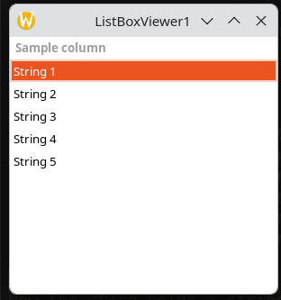
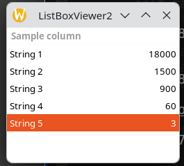
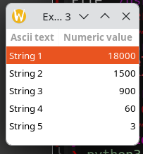
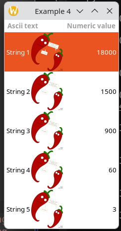

# Listbox, anyone?

Many popular UI toolkits have their listbox control implemented to be as simple in use as possible. The most common operations are: creating the control, adding the data rows, deleting and editing data, handling the selection. Almost all toolkits provide single functions or suitable methods to realize above operations.

`Gtk+` is quite different: it requires more abstract way of thinking and additional objects to be created, but the lists and trees are more flexible and elegant.


# Storing the data

Before we can display a single string, let's first earn a PhD in data models.

Unlike the the other toolkits, the gtk+ list allows to display a few values per a row. Gtk+ list also distinguishes between the types of data, while other lists treat its row data as a single string.

In fact, the `TreeView` widget will be used to display elements. The model lets the display widget know about data types to be used in the control, it also determines the type of the control (if it should be a list or a tree). Besides, the model is used to store all the data (it is common to find a "store" term instead of "model" in various papers or in someone's code)

A store/model can be created by calling a proper constructor with at least one data type (to be used in the list) as argument:
```python
store = Gtk.ListStore(type1, ...)
```

Example:
```python
store = Gtk.ListStore(int, str, str)
```

Created store will contain one integer value and two strings per row. Although pygtk reference recommends to use build-in GObject types (for instance, gobject.TYPE_INT and gobject.TYPE_STRING instead of int and str respectively), python built-in types are also allowed (GObject names really matter in C or C++)

# Adding the data rows

The method append from Gtk.ListStore class allows to append one row at the end of the store. Sequence with all values should be passed as a parameter:
```python
store.append([val1, ...])
```

Example:
```python
store.append([7, "str1", "str2"])
```

# Columns and renderers

Control widget should know about columns it should display, their order and how to present data from the store. Gtk+ provides the column widget (Gtk.TreeViewColumn) to manage displaying the cells of data and renderer widgets (Gtk.CellRenderer and its derivatives) to realize rendering of particular cells.

Column widget is usually created by calling a constructor of `Gtk.TreeViewColumn` with a header title passed as the argument:
```python
column = Gtk.TreeViewColumn(title)
```

Example:
```python
column = Gtk.TreeViewColumn("Column header")
```

Column header is visible by default — passing an empty string to the constructor will not get rid of it.

Cell renderer should be one of `Gtk.CellRendererAccel`, `Gtk.CellRendererCombo`, `Gtk.CellRendererPixbuf`, `Gtk.CellRendererProgress`, `Gtk.CellRendererSpin`, `Gtk.CellRendererText`, `Gtk.CellRendererToggle`. The renderer object is usually created by calling the constructor with no parameters

Example:
```python
renderer = Gtk.CellRendererText()
```

Renderers should be added to the column widgets: pack_start and pack_end methods are used to do the packing.
```python
column.pack_start(renderer)
```
or
```python
column.pack_end(renderer)
```

Example:

```python
column1 = Gtk.TreeViewColumn("Column1")
renderer1 = Gtk.CellRendererText()
renderer2 = Gtk.CellRendererText()
renderer3 = Gtk.CellRendererText()
column1.pack_start(renderer1)
column1.pack_start(renderer2)
column1.pack_end(renderer3)
```

The column widget must know which data column from the model should be connected to any of these renderers. This could be done by calling set_attributes method:

```python
column.set_attributes(renderer, ...)
```

All optional parameters are "key = value" pairs, where key is the data type and value is number of column in the store

Example:
```python
column1.set_attributes(renderer1, text = 2)
column1.set_attributes(renderer2, text = 0)
column1.set_attributes(renderer3, text = 1)
```

# TreeView control

The last step is to create a control and add all columns. Constructor of the control takes the store as first parameter:
```python
listControl = Gtk.TreeView(model=store)
```

The method append_column adds given column to the tree/list control:

```python
listControl.append_column(column)
```

Summary: at least, four objects should be created to have the tree/list control working: a model which determines types of data and stores all the rows, a renderer, which takes care of displaying the cells, a column, which glues together model columns and suitable renderers and a treeview control itself.


# Working examples

Following examples illustrate the creation and displaying of the lists.

## Very simple list control

The simplest list control contains only one column and displays only one value per row

```python
#!/usr/bin/env python3
  
import gi

gi.require_version("Gtk", "3.0")
from gi.repository import Gtk
 
class ListBoxViewer1:
    def destroyCallback(self, widget, data=None):
        Gtk.main_quit()
  
    def __init__(self):
        self.listStore = Gtk.ListStore(str)
        self.listStore.append(["String 1"])
        self.listStore.append(["String 2"])
        self.listStore.append(["String 3"])
        self.listStore.append(["String 4"])
        self.listStore.append(["String 5"])
        self.listColumn = Gtk.TreeViewColumn("Sample column")
        self.textRenderer = Gtk.CellRendererText()
        self.listColumn.pack_start(self.textRenderer, True)
        self.listColumn.set_attributes(self.textRenderer, text = 0)
        self.mainWindow = Gtk.Window(type=Gtk.WindowType.TOPLEVEL)
        self.mainWindow.set_title('ListBoxViewer1');
        self.listBox = Gtk.TreeView(model=self.listStore)
        self.listBox.append_column(self.listColumn)
        self.mainWindow.add(self.listBox)
        self.mainWindow.connect('delete_event', self.destroyCallback)
        self.mainWindow.show_all()

if __name__ == "__main__":
    lbv1 = ListBoxViewer1()
    Gtk.main()
```

This example covers the theory of creating listboxes with additional routines necessary to run minimal gtk+ program. Additional method is added to provide termination of this example when its window has been closed.

All list-related routines are explained below:
```python
self.listStore = Gtk.ListStore(str)
self.listStore.append(["String 1"])
self.listStore.append(["String 2"])
self.listStore.append(["String 3"])
self.listStore.append(["String 4"])
self.listStore.append(["String 5"])
```

The model is created: it can hold one string value per a row. Then it is populated by 5 rows.
```python
self.textRenderer = Gtk.CellRendererText()
```

Text renderer is created.
```python
self.listColumn = Gtk.TreeViewColumn("Sample column")
self.listColumn.pack_start(self.textRenderer, True)
self.listColumn.set_attributes(self.textRenderer, text = 0)
```

A column is created. Then the renderer is packed into the column, and the column is informed which column and what type of data from the store will be used.
```python
self.listBox = Gtk.TreeView(self.listStore)
self.listBox.append_column(self.listColumn)
```

Main widget is created. The column is appended to the list.

It looks like the following:



Explanation of the next examples contains only the routines related to list control; other routines did not change if not mentioned.

## Two values per row

```python
 self.listStore = Gtk.ListStore(str, int)
 self.listStore.append(["String 1", 18000])
 self.listStore.append(["String 2", 1500])
 self.listStore.append(["String 3", 900])
 self.listStore.append(["String 4", 60])
 self.listStore.append(["String 5", 3])
```

Now the store holds a string an integer pair per a row.
```python
self.listColumn = Gtk.TreeViewColumn("Sample column")
self.textRenderer = Gtk.CellRendererText()
self.numRenderer = Gtk.CellRendererText()
self.numRenderer.set_property('xalign', 1.0)
```

A column and two cell renderers are created. The set_property routine with xalign property to be set tells the renderer to align right the values in the row. Value of 0.0 means left alignment, 0.5 centers the text and 1.0 means right alignment.

```python
self.listColumn.pack_start(self.textRenderer, True)
self.listColumn.pack_start(self.numRenderer, False)
self.listColumn.set_attributes(self.textRenderer, text = 0)
self.listColumn.set_attributes(self.numRenderer, text = 1)
```

The two renderers are packed into the column. The string value renderer will expand the cell if possible. Proper renderers are assigned to proper data columns from the store.
```python
self.listBox = Gtk.TreeView(store=self.listStore)
self.listBox.append_column(self.listColumn)
```

The control is created and the column is appended to the control.

The following picture shows the result of this example:



## Two columns in the control

```python
self.listColumn1 = Gtk.TreeViewColumn("Ascii text")
self.listColumn2 = Gtk.TreeViewColumn("Numeric value")
self.textRenderer = Gtk.CellRendererText()
self.numRenderer = Gtk.CellRendererText()
self.numRenderer.set_property('xalign', 1.0)
self.listColumn1.pack_start(self.textRenderer, True)
self.listColumn2.pack_start(self.numRenderer, False)
self.listColumn1.set_attributes(self.textRenderer, text = 0)
self.listColumn2.set_attributes(self.numRenderer, text = 1)
```

Every column packs one of the renderes. It looks like the following:



## Adding pixmaps to the list

Now, creating the store is like below:

```python
self.sheetIcon = Gtk.gdk.pixbuf_new_from_file("sheet.xpm");
self.listStore = Gtk.ListStore(str, int, Gtk.gdk.Pixbuf)
self.listStore.append(["String 1", 18000, self.sheetIcon])
self.listStore.append(["String 2", 1500, self.sheetIcon])
self.listStore.append(["String 3", 900, self.sheetIcon])
self.listStore.append(["String 4", 60, self.sheetIcon])
self.listStore.append(["String 5", 3, self.sheetIcon])
```

The pixbuf is added in every row. Of course, it may be different in every row. This is only the example.

```python
self.iconRenderer = Gtk.CellRendererPixbuf()
```

The icon requires a special kind of cell renderer.

```python
self.listColumn1.pack_start(self.iconRenderer, False)
self.listColumn1.set_attributes(self.iconRenderer, pixbuf = 2)
```

Pixbuf cell renderer is now packed into the first column together with the text renderer.

It looks like the following:




## Display the same values twice or more times

Displaying more values per row is achieved by multiplicating the renderes:

```python
self.listColumn1 = Gtk.TreeViewColumn("Ascii text")
self.listColumn2 = Gtk.TreeViewColumn("Numeric value")
self.textRenderer = Gtk.CellRendererText()
self.textRenderer2 = Gtk.CellRendererText()
self.numRenderer = Gtk.CellRendererText()
self.numRenderer2 = Gtk.CellRendererText()
self.numRenderer3 = Gtk.CellRendererText()
self.iconRenderer = Gtk.CellRendererPixbuf()
self.iconRenderer2 = Gtk.CellRendererPixbuf()
self.numRenderer.set_property('xalign', 1.0)
self.numRenderer2.set_property('xalign', 0.0)
self.numRenderer2.set_property('xalign', 0.5)
self.textRenderer2.set_property('xalign', 1.0)
self.listColumn1.pack_start(self.iconRenderer, False)
self.listColumn1.pack_start(self.textRenderer, True)
self.listColumn2.pack_start(self.numRenderer, False)
self.listColumn2.pack_start(self.numRenderer2, False)
self.listColumn2.pack_start(self.iconRenderer2, False)
self.listColumn2.pack_start(self.numRenderer3, False)
self.listColumn2.pack_start(self.textRenderer2, True)
self.listColumn1.set_attributes(self.iconRenderer, pixbuf = 2)
self.listColumn1.set_attributes(self.textRenderer, text = 0)
self.listColumn2.set_attributes(self.numRenderer, text = 1)
self.listColumn2.set_attributes(self.numRenderer2, text = 1)
self.listColumn2.set_attributes(self.numRenderer3, text = 1)
self.listColumn2.set_attributes(self.textRenderer2, text = 0)
self.listColumn2.set_attributes(self.iconRenderer2, pixbuf = 2)
```

Also, the left, right and center alignment of text is shown.

It looks like the following:

[image]
