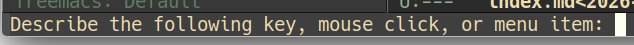
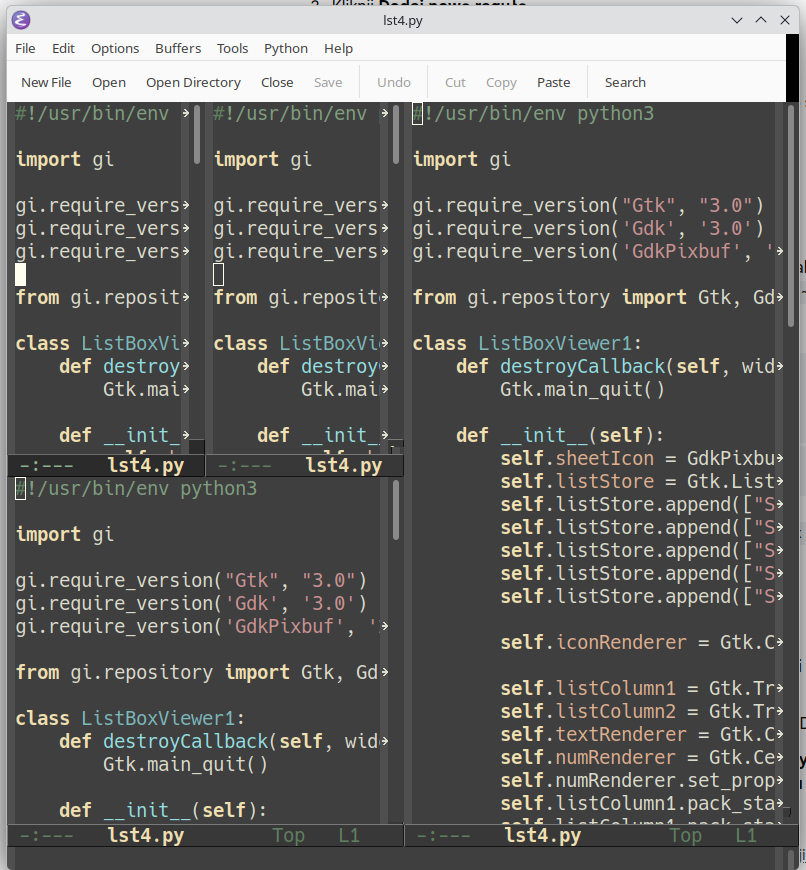

# Buffer Overflow

Today we begin in a slightly unusual place.

## Interrupting the Current Operation

If there is one key binding worth remembering before you even open your first file in Emacs, it is this one:

```text
C-g
```

While Emacs is executing some more complicated Lisp code, it may occasionally stop responding to user commands and give the impression that it has frozen.

Nothing could be further from the truth.

Emacs is not dead. It is merely busy executing that unfortunate piece of Lisp.

There are two possible approaches:

* wait patiently until the Lisp interpreter finishes its work,
* or interrupt it.

The latter is usually more practical.

* `C-g` interrupts the current operation. It works when Emacs is running a long command, waiting for minibuffer input, or otherwise pretending not to hear you.
* `M-x keyboard-quit` is the function bound to `C-g` by default. Calling it manually is usually pointless: when Emacs is busy, you cannot invoke it, and when Emacs is not busy, there is nothing to interrupt. Still, the name is worth knowing if you ever decide to remap keys.

If you forget everything else from this section, remember `C-g`.

When something goes wrong, Emacs will usually listen.

Lisp programmers are less predictable.

# What Does This Key Do?

Let us continue.

Emacs contains an excellent built-in help system. One of its most useful features is the ability to ask:

> What command is this key binding actually running?

To find out, use:

* `M-x describe-key`
* or, more conveniently, `C-h k`

Emacs will then ask you to press a key sequence, mouse button, or menu item.

For example:

```text
C-h k C-p
```

opens a help buffer describing the command bound to `C-p`.



A shortened version looks like this:

```text
C-p runs the command previous-line.

It is bound to C-p and <up>.

Move cursor vertically up ARG lines.

This function is for interactive use only;
in Lisp code use `forward-line' with negative argument instead.
```

Even this small fragment tells us quite a lot:

* which function is bound to the key,
* where the function comes from,
* which other keys invoke the same command,
* what the command does,
* whether it is meant for interactive use,
* and sometimes which related commands or variables are worth knowing about.

This is one of Emacs' great strengths.

The program is not merely configurable. It is also unusually good at explaining itself.

> **Bookmark:** if you have reached this point and started yawning, leave this article open. Tomorrow you will know exactly where to resume reading.
>
> You do not have to thank me.

# What Does This Function Do?

The same idea works in the other direction.

If you know the name of a function and want to inspect it, use:

* `M-x describe-function`
* or simply `C-h f`

For example:

```text
C-h f find-file
```

opens a help buffer for the function used to visit files.


A shortened fragment looks like this:

```text
find-file is an interactive function in `files.el`.

It is bound to <open> and C-x C-f.

Edit file FILENAME.
Switch to a buffer visiting file FILENAME, creating one if none already exists.

You can visit files on remote machines by specifying something like:

/ssh:SOME_REMOTE_MACHINE:FILE

You can also visit local files as a different user by specifying:

/sudo::FILE

To visit a file without conversion and without automatically choosing
a major mode, use M-x find-file-literally.
```

This is why reading Emacs help buffers is often surprisingly useful.

Even a command as ordinary as `find-file` turns out to do more than merely open files.

Several useful details appear immediately:

* **Wildcards** — file name patterns can be expanded, allowing multiple files to be opened at once.
* **Remote files** — paths such as `/ssh:some-host:some-file` open files over SSH.
* **Files as another user** — paths such as `/sudo::some-file` allow editing files with elevated privileges.

The last option is useful for editing configuration files that require administrative access.

Other possible uses are left to the reader's imagination and the local security department.

At this point, Dear Reader, I assume you have already typed a single `*` in some directory full of random files and discovered that Emacs can open rather more things than expected:

* images,
* PDFs,
* OpenOffice and LibreOffice documents,
* documents produced by that office suite which now apparently wishes to be known as a co-pilot,
* EPUB and MOBI files,
* archives,
* and many other formats.

It probably will not play your movies, but it can certainly inspect archives.

What to do with all those joyfully opened files will be discussed a little later.

# Buffers and Frames

Dividing the working area of a frame into two or more windows was invented mainly so that several buffers could be displayed side by side.

Anyone who writes code probably understands the value of that immediately.

The King of Editors can split a frame both horizontally and vertically. The resulting windows can be split again, although not forever. Once a window becomes too small, Emacs will politely refuse and display an appropriate message.

Useful key bindings:

* `C-x 2` — split the current window horizontally
* `C-x 3` — split the current window vertically
* `C-x 1` — delete all other windows and return to a single-window layout
* `C-x 0` — delete the current window
* `C-x 5 2` — create a new frame
* `C-x 5 1` — delete other frames
* `C-x 5 0` — delete the current frame
* `C-x o` — move focus to the next window
* `C-x S-o` — move focus to the previous window

A very important detail:

`C-x 1` removes window splits, but it does not kill any buffers. The buffers remain open; only one of them is currently visible.



# Working with Multiple Buffers

Emacs can open as many buffers as available memory allows.

Because of that, there is usually no point in starting another Emacs instance every time you want to open another file. When you need another file, open it in the same Emacs session.

Emacs was designed for working with many buffers at once. Running several separate instances is possible, but in everyday use it is rarely necessary.

> Yes, this is the "a little later" mentioned above.

If a file is no longer needed, kill its buffer with:

```text
C-x k
```

By default, Emacs asks what to do with buffers that contain unsaved changes.

You can move to the previous or next buffer with:

* `C-x Left`
* `C-x Right`

You can also switch directly to a named buffer using:

```text
C-x b
```

If the buffer visits a file, its name is usually the same as the file name.

If you do not remember the exact name, press `TAB`. Emacs will display possible completions in a temporary window. You can also start typing and let completion narrow the list.

Completion, selection, and minibuffer behavior are, of course, topics for another volume of the Emacs saga.

To list all buffers, use:

```text
C-x C-b
```

This opens a buffer containing the buffer list. You can move into that buffer and choose one of the listed entries.

The buffer list does not automatically refresh every time a new buffer is created. This makes sense once you realize that the buffer list is itself just another buffer.

Press:

```text
g
```

to refresh it.

What else can be done inside the buffer list?

As homework, press:

```text
?
```

and read the help page.

# Scrolling Another Window

One of the more useful Emacs features is the ability to scroll the contents of another window while continuing to work in the current one.

No switching back and forth.

No mouse.

No unnecessary ceremony.

If you are writing in one window and need to inspect something above or below in another window, Emacs has you covered.

This is especially useful when both windows display different parts of the same file and you want to check what regrettable code you wrote earlier.

Useful key bindings:

* `C-M-v` — scroll the other window down
* `C-M-S-v` — scroll the other window up

Alternative bindings:

* `M-PageDown` — scroll the other window down
* `M-PageUp` — scroll the other window up

This is one of those features that sounds minor until you start using it. After a few days, working without it feels unnecessarily clumsy.

> **A note that will age badly and is not really on topic:** at the moment, southern Poland is experiencing temperatures that feel entirely incompatible with human life. Some people of questionable judgment still insist that climate change does not exist, and that trains in the seventeenth century were also stuffy.
>
> Drink enough water.
>
> This is not a joke.
>
> Otherwise, the seventeenth-century train will arrive for you personally.
