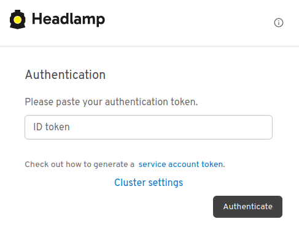
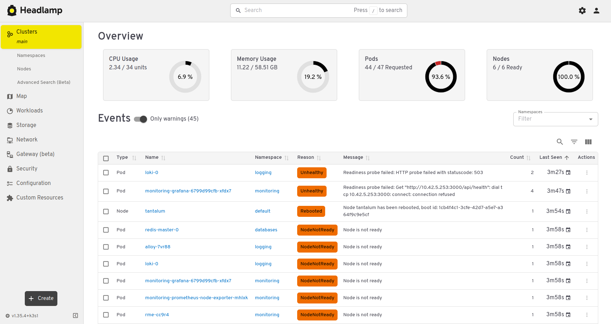
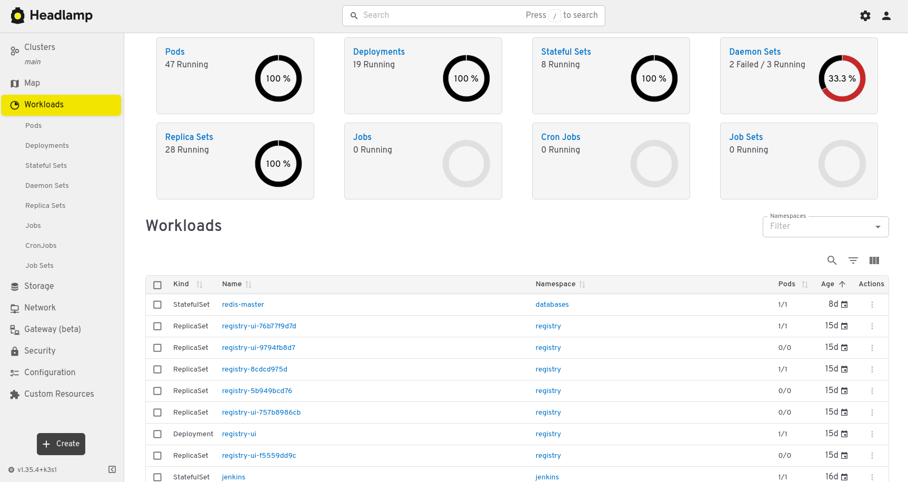
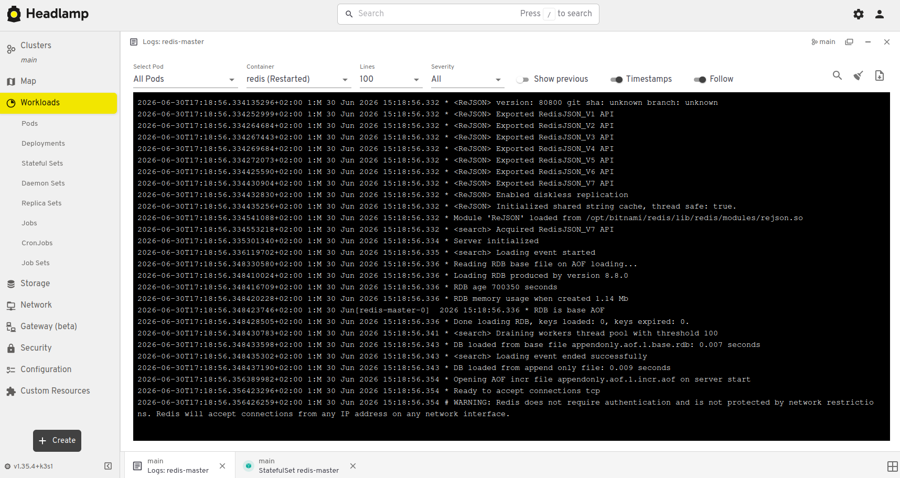
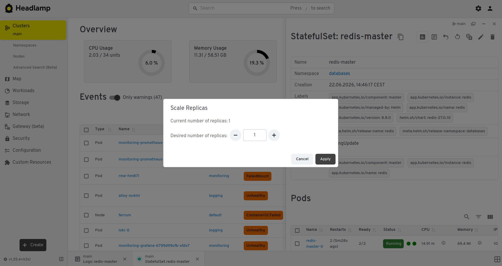
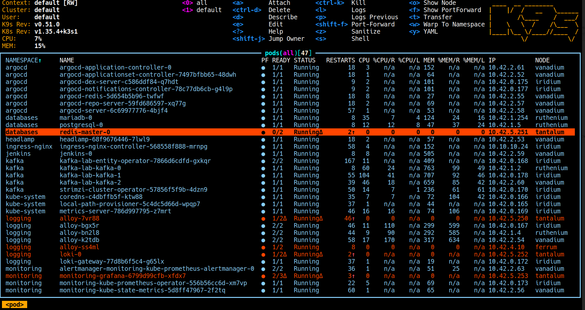

# Suit Up and March On!

## What is Helm?

Kubernetes is popular enough that it was only a matter of time before someone came up with a way to install applications using one or two commands instead of manually assembling yet another small mountain of YAML files.

That tool is called **Helm**. It helps define, install, upgrade and manage applications running inside a Kubernetes cluster.

Think of it as the Kubernetes equivalent of `apt`, `dnf` or `brew` — except instead of installing packages on a machine, it installs applications into your cluster.

## How does it work?

Helm introduces three basic concepts:

* **Chart** — a package containing templates for all Kubernetes manifests required by an application.
* **Values** — parameters used to customize those templates.
* **Release** — a deployed instance of a chart inside a cluster. The first installation creates the initial revision, and every upgrade creates another one, making rollbacks straightforward.

In practice, you take a chart, adjust its values, install it into the cluster and get a named release that Helm can later upgrade, list, inspect or remove.

## What do we need?

Not much:

* a Kubernetes cluster,
* `kubectl`,
* `helm`.

Our first application will be **Headlamp**.

Kubernetes Dashboard still exists, but these days Headlamp is often the more pleasant choice, so that is what we will use here.

Headlamp is one of those rare applications that you install once and it simply works. Such things deserve appreciation.

## Installing applications with Helm

Most applications are distributed through Helm repositories.

Adding one is simple:

```bash
helm repo add repository-name https://some.repo.url
helm repo update
helm install my-application repository-name/chart
```

`repository-name` is your local alias for the repository.

Likewise, `my-application` is the name of your release. It may look redundant at first, but imagine testing three different MariaDB installations from three different sources. Suddenly meaningful release names start looking less like ceremony and more like self-defense.

`helm repo update` works much like `apt update`: it refreshes the local cache with information about available chart versions.

You can also search through charts available in your configured repositories:

```bash
helm search repo headlamp
helm search repo bitnami
```

## Where do the values come from?

The easiest way is to ask Helm for the default configuration:

```bash
helm show values repository-name/chart > values.yaml
```

Then edit the generated file and adjust it to your environment.

For Headlamp, the following `values.yaml` is enough for this lab:

```yaml
config:
  inCluster: true

ingress:
  enabled: true
  ingressClassName: nginx
  hosts:
    - host: headlamp.lab.local
      paths:
        - path: /
          type: Prefix

nodeSelector:
  przeznaczenie: observability
```

We need to define the Ingress class, the hostname under which the application will be available, and optionally a `nodeSelector` if we want to control where the Pod runs.

As usual in this lab setup, we also need to add the hostname to `/etc/hosts` on every machine that will access the service, including the workstation:

```text
10.10.10.24 headlamp.lab.local
```

## Installing Headlamp

Now comes the easy part:

```bash
helm repo add headlamp https://kubernetes-sigs.github.io/headlamp/
helm repo update

helm install headlamp headlamp/headlamp \
    --namespace headlamp \
    --create-namespace \
    -f values.yaml
```

After opening the URL in a browser, we get a friendly login screen:



Headlamp asks for a Kubernetes authentication token.

Generating one is straightforward:

```bash
kubectl -n headlamp create token headlamp
```

The application itself is clean, tasteful and not overloaded with options. Most things are exactly where you expect them to be.





You can browse resources, inspect logs and click through various settings without leaving the browser.





> Another excellent Kubernetes client is **k9s**. It runs entirely in the terminal, so you do not get fancy graphical topology views, but everything else is there — and it is fast.



As you can see, basic Helm usage is pleasantly simple.

## Installing databases

There is not much point in overexplaining databases here. We are going to install a few of them from a popular public repository and see how little work is actually required.

We will use Bitnami's repository:

```bash
helm repo add bitnami https://charts.bitnami.com/bitnami
helm repo update

kubectl create namespace databases
```

The separate namespace is not strictly magical, but it keeps things tidy.

## PostgreSQL

Example `values.yaml`:

```yaml
global:
  storageClass: local-path

architecture: standalone

auth:
  postgresPassword: "some-password"
  username: "marcin"
  password: "some-other-password"
  database: "utensils"

primary:
  nodeSelector:
    przeznaczenie: heavy-worker

  persistence:
    enabled: true
    size: 20Gi

  service:
    type: NodePort
    ports:
      postgresql: 5432
    nodePorts:
      postgresql: 30432
```

The database will be exposed through NodePort **30432**.

Since this is not a web application, we need to remember which node actually hosts the Pod. Thanks to the `nodeSelector`, that should be `10.10.10.25`.

Installation:

```bash
helm install postgresql bitnami/postgresql \
    --namespace databases \
    -f values.yaml
```

Afterwards Helm prints a few useful notes, including commands for retrieving generated credentials:

```text
To get the password for "postgres" run:

export POSTGRES_ADMIN_PASSWORD=$(kubectl get secret --namespace databases postgresql -o jsonpath="{.data.postgres-password}" | base64 -d)

To get the password for "marcin" run:

export POSTGRES_PASSWORD=$(kubectl get secret --namespace databases postgresql -o jsonpath="{.data.password}" | base64 -d)
```

## MariaDB

Example configuration:

```yaml
global:
  storageClass: local-path

architecture: standalone

auth:
  rootPassword: "some-password"
  database: "utensils"
  username: "marcin"
  password: "some-other-password"

primary:
  nodeSelector:
    przeznaczenie: heavy-worker

  persistence:
    enabled: true
    size: 20Gi

  service:
    type: NodePort
    ports:
      mysql: 3306
    nodePorts:
      mysql: 30306
```

This database will listen on NodePort **30306**, on the same node as PostgreSQL.

Installation:

```bash
helm install mariadb bitnami/mariadb \
    --namespace databases \
    -f values.yaml
```

Administrator credentials can be retrieved from the generated Secret:

```text
Username: root
Password: $(kubectl get secret --namespace databases mariadb -o jsonpath="{.data.mariadb-root-password}" | base64 -d)
```

## Redis

Example configuration:

```yaml
architecture: standalone

auth:
  enabled: false

master:
  nodeSelector:
    przeznaczenie: heavy-worker

  persistence:
    enabled: true
    storageClass: local-path
    size: 5Gi

  resources:
    requests:
      cpu: 50m
      memory: 128Mi
    limits:
      memory: 512Mi

metrics:
  enabled: true
  serviceMonitor:
    enabled: true
    namespace: databases
```

Installation is exactly what you would expect:

```bash
helm install redis bitnami/redis \
    --namespace databases \
    -f values.yaml
```

At this point the cluster is starting to look like an actual environment instead of an empty playground.

As an exercise, I recommend installing a few well-known applications and checking how they are packaged, configured and exposed. There is no need to rediscover America when so many useful things are already available in public Helm repositories.

## Updating an application

Sooner or later, you will change something in `values.yaml`.

Instead of uninstalling and installing the application again, upgrade the existing release:

```bash
helm upgrade headlamp headlamp/headlamp \
    --namespace headlamp \
    -f values.yaml
```

Helm applies the new configuration while preserving release history. If something goes sideways, that history becomes useful very quickly.

## Removing applications

When an application outlives its usefulness — and why is it always Headlamp? — removing it is just as easy:

```bash
helm uninstall my-application
```

If it was installed in a specific namespace, add it explicitly:

```bash
helm uninstall my-application \
    --namespace namespace-name
```

## Listing installed releases

This command shows releases from the current namespace:

```bash
helm list
```

Which is technically correct and practically disappointing most of the time.

Usually, this is what you want:

```bash
helm list -A
```

It lists releases across all namespaces.

And that is the nice thing about Helm: the basic workflow stays small.

Add a repository, inspect the values, install a release, upgrade it when needed, list what is running, remove what is no longer useful. Underneath, Kubernetes still does Kubernetes things, but at least you do not have to hand-write every single manifest like it is some YAML-based monastic ritual.
