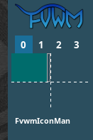
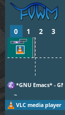
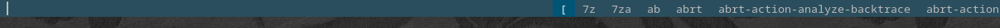
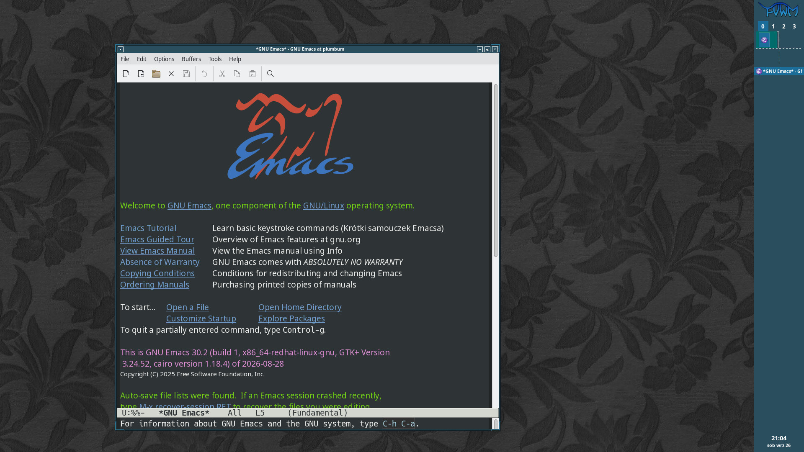
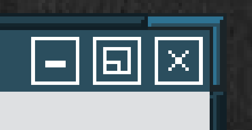
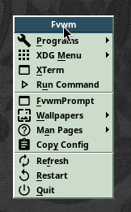
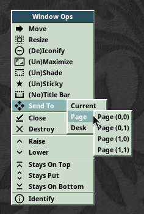
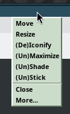
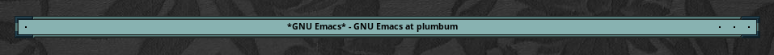
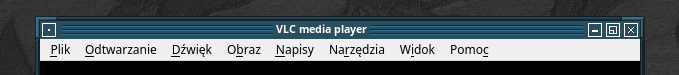

Thirty-three years is a very long time in software.

Trends change.

Architectures come and go.

Companies collapse, occasionally taking genuinely excellent projects to the grave with them.

It is long enough that, back in 1993, I was considering moving from a Commodore 64 to an Amiga 500 — which never actually happened — while in 2026 I find myself interested in software from that same era which somehow still exists.

And not merely exists.

Some of it is doing remarkably well.

In 1993, engineer **Robert Nation** needed a lightweight window manager for a 33 MHz 486 laptop with just 4 MB of RAM.

At the same time, his work involved analyzing enormous spectrograms, and he needed a virtual desktop larger than a single physical screen.

**TWM** worked, but it consumed more memory than he liked and did not provide everything he needed.

So he did what any reasonable programmer dissatisfied with an existing tool would do:

he started taking it apart.

The result was **FVWM**.

Its first public version was bundled with an `rxvt` release on June 1, 1993. Soon afterward FVWM became an independent project, and it is still with us today.

Despite more than three decades of development, it has retained much of its original character:

it is lightweight, modular, extraordinarily configurable, and assumes that the user may actually know how their own desktop should behave.

# F? VWM

So what does the name mean?

Today the official project calls it:

**F? Virtual Window Manager**

where `F?` can be expanded into almost anything beginning with the letter F.

Preferably something printable.

Originally, however, the `F` had a very specific meaning:

**Feeble Virtual Window Manager**.

Robert Nation himself confirmed this, explaining that the earliest versions offered very few user-selectable features, so _feeble_ was a fairly accurate description.

The software eventually stopped being feeble in any meaningful sense, while the interpretation of the letter F drifted into folklore.

The modern project page suggests words such as:

_fantastic, fabulous, famous, flexible..._

and wisely leaves the rest to the user's imagination.

## What Exactly Is a Window Manager?

That is a reasonable question.

What sort of software is this?

And why should anyone care?

A **window manager** manages application windows within a graphical session.

In the X11 world it is responsible for things such as:

- window placement,
- size,
- stacking order,
- focus,
- decorations,
- minimization,
- maximization,
- switching between windows.

An application creates a window.

The window manager decides what happens to it next.

And that is all?

More or less.

Which is exactly what makes the idea interesting.

GNOME, KDE Plasma, Xfce, and LXQt are complete **desktop environments**.

They are collections of cooperating components that usually provide things such as:

- panels,
- menus,
- session management,
- display configuration,
- settings tools,
- notifications,
- desktop icons,
- wallpapers,
- device integration,
- often an entire set of applications.

A window manager is only one part of that puzzle.

In the old days, an X11 desktop was often assembled gradually.

Need a panel?

Install one.

Need a menu?

Add one.

Want a wallpaper?

Run a wallpaper setter.

Need desktop icons, a notification area, media controls, or animated penguins wandering around the screen?

No problem.

`xpenguins` is waiting.

Today, we are much more likely to install an entire desktop environment and accept whatever came from the factory.

And the factory keeps providing more.

Increasingly tightly integrated.

Eleven out of ten users never even change the wallpaper.

## What Does FVWM Provide?

**FVWM** is a classic window manager in exactly that older tradition.

Its primary concern is windows and how they behave.

Want a panel?

You can have one.

Menus?

Of course.

A pager?

Certainly.

A window list?

Also available.

But FVWM does not assume that its developers know better than you how all of those things should look or behave.

The default configuration provides enough to get started and then seems to say:

> Run me.  
> Use me.  
> Decide what is missing.  
> Then configure it yourself.

That is what its extensive configuration system is for.

The official project describes FVWM3 as a lightweight floating window manager for X11 that can be configured as anything from a small minimal setup to something resembling a complete desktop environment.

# Installation

I assume you already have _some_ graphical environment installed.

Modern Linux distributions usually come with KDE, GNOME, Xfce, LXQt, or something similar.

You therefore probably also have a display manager.

In my case, this is **Fedora with KDE Plasma and SDDM**.

Installation is straightforward:

```bash
sudo dnf install fvwm3 dmenu
```

The first package contains **FVWM3** itself.

The second provides `dmenu`, which the default FVWM configuration uses as a simple application launcher.

It is worth checking that the package installed an X session definition:

```bash
rpm -ql fvwm3 | grep xsessions
```

On my system:

```text
/usr/share/xsessions/fvwm3.desktop
```

Excellent.

Log out.

Select **FVWM3** on the login screen.

Enter the password.

Press `Enter`.

And...

# Hello Darkness

...enjoy the majestic sight of absolutely nothing.

The session did not start.

The reason turned out to be simple:

**FVWM3 is an X11 window manager**, while my Fedora installation only had Wayland available.

FVWM3 is still primarily built around Xlib and the X Window System.

So Xorg needs to be installed:

```bash
sudo dnf install xorg-x11-server-Xorg
```

Fedora 44 still ships Xorg separately for X11 sessions and software that depends on it.

Log in once more.

Ah.

Much better.

## Configuring X11

The biggest surprise after all these years is that X11 no longer needs to be configured.

It simply starts.

And works.

There is no need to:

- select graphics drivers manually,
- describe the monitor,
- write `Modeline` entries,
- configure the mouse,
- configure the keyboard,
- specify font directories.

I remember a time when starting X11 and getting a black screen instead of smoke already counted as progress.

Today it simply works.

Thank you, 2026.

# First Start

The default **FVWM3** session looks like this:


What exactly are we looking at?

On the right is a panel constructed with the `FvwmButtons` module.

It contains:

- the FVWM logo — still maintaining the cat theme,
- desktop buttons `0–3`,
- a pager,
- an area for open windows managed by `FvwmIconMan`,
- a clock and date display.

This is essentially what the current upstream default configuration defines.

As applications are opened, the panel gradually fills up:





That is already quite a lot.

We can even launch something.

Press:

```text
Alt+Space
```

and `dmenu_run` appears.

The current default FVWM configuration binds exactly that command to `Alt+Space`, provided `dmenu` is installed.

It displays executables found through `$PATH`.

Which means:

a lot of things.

Far too many things.

Fortunately, the list is filtered as you type.



## Windows

The first application window looks something like this:



There is:

- a title bar,
- buttons on both sides,
- a frame,
- borders,
- corners.



The button on the left opens the window operations menu.

The ones on the right perform more obvious jobs such as closing, maximizing, and minimizing.

Drag the title bar to move the window.

Drag an edge to resize it.

Drag a corner to resize it in two directions at once.

The technology is clearly almost ready for worldwide adoption.

Click the **left mouse button** on the root window and the main FVWM menu appears:



Not bad.

The important commands are already present.

Including:

- `Restart`,
- `Quit`.

`Restart` will become extremely useful in future episodes.

Trust me.

## Desks and Pages

One of FVWM's more interesting features is its enormous virtual workspace.

The default configuration provides four **desks**:

```text
0 1 2 3
```

Each desk can itself contain multiple **pages**.

FVWM therefore distinguishes between two concepts:

**Desk** — a separate desktop.

**Page** — a position within the larger virtual space of that desktop.

With the normal global multi-monitor configuration, all connected displays together form the visible area of one page.

This means the virtual desktop can extend beyond the complete physical monitor arrangement.

Then you can have several such virtual spaces.

And several desks containing those.

Sounds excessive?

Give it a few days.

You will run out of room.

This becomes especially useful when many windows are open and you want to group them by purpose.

One desk for code.

One for documentation.

One for communication.

One for terminals that have been open for so long that nobody dares close them anymore.

Open a window and try dragging it beyond the current visible workspace.

Near the edge, you will feel a slight resistance.

Keep going.

The window crosses onto the neighboring page.

At that moment the physical screen stops feeling like the desktop itself.

It becomes merely a viewport onto something much larger.

## Menus and Window Information

Clicking the **right mouse button** on the root window opens the window operations menu.

At this point no particular window has been selected.

First choose the operation.

Then choose the target window.



For example, choose:

**Identify**

and then:

**GNU Emacs**.

`FvwmIdent` appears:


At first it looks like a collection of obscure X11 properties.

Later, these values become extremely useful when writing configuration rules.

That is precisely what `FvwmIdent` is intended for: among other things, identifying a window's name, resource, and class.

Clicking the **middle mouse button** on the root window displays a window list, including geometry information.

Its main purpose is to activate another window quickly.

`Alt+Tab` produces a simpler window list without geometry.

The default configuration binds this directly to FVWM's `WindowList`.

Clicking the **right mouse button on a title bar** opens the current window's operations menu:



Among the more interesting entries are:

- **Stick / Unstick** — make the window appear across desks, or return it to normal behavior,
- **Shade / Unshade** — collapse the window until only the title bar remains, then restore it.





And that is enough for the first encounter.

Spend a while moving windows around, switching desks, exploring pages, and generally discovering how much space FVWM is prepared to give you.

Then choose **Quit** from the main menu.

In the next episode, we will log in again.

But this time, into **our** FVWM.
