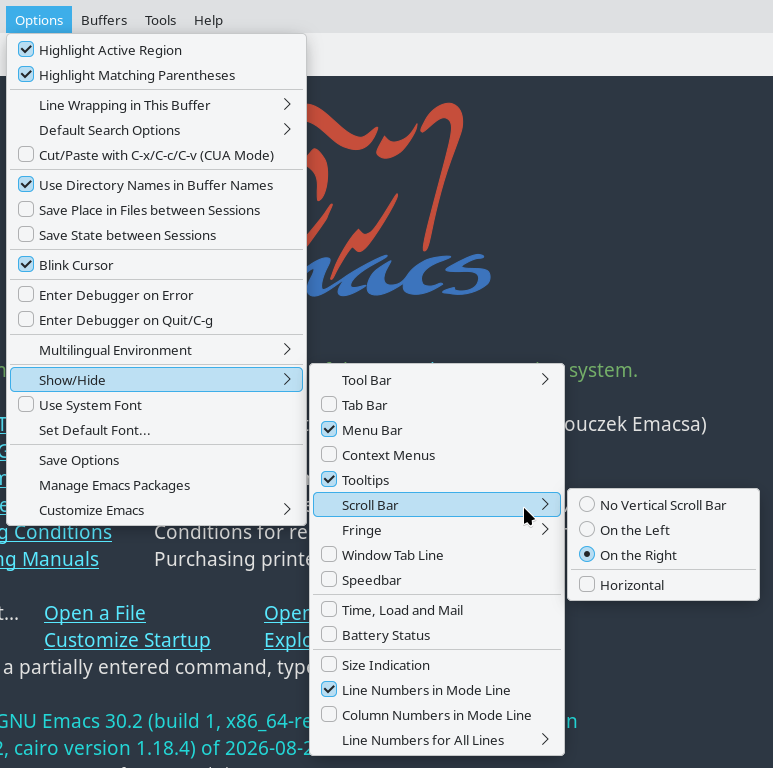
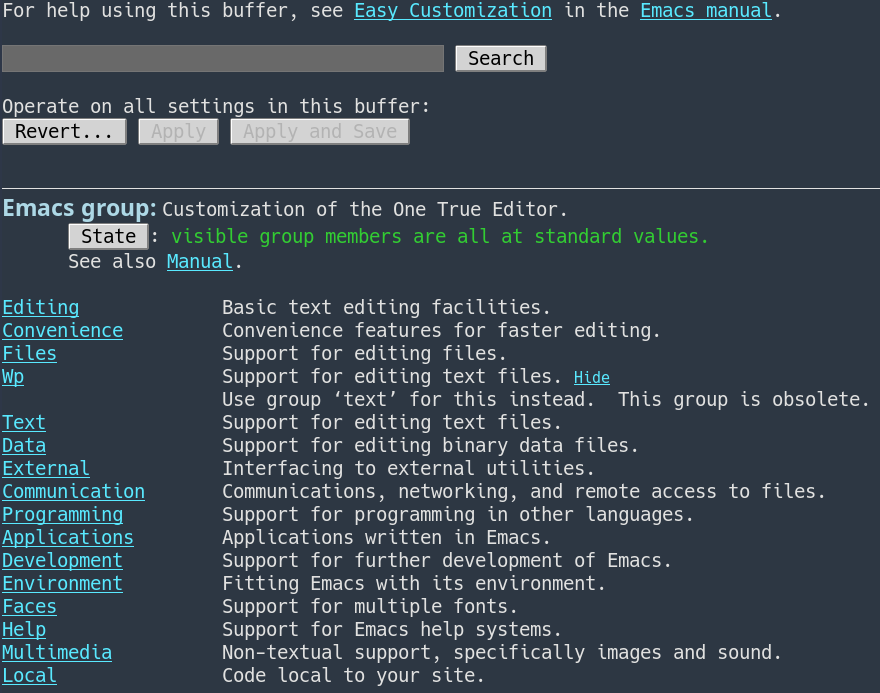
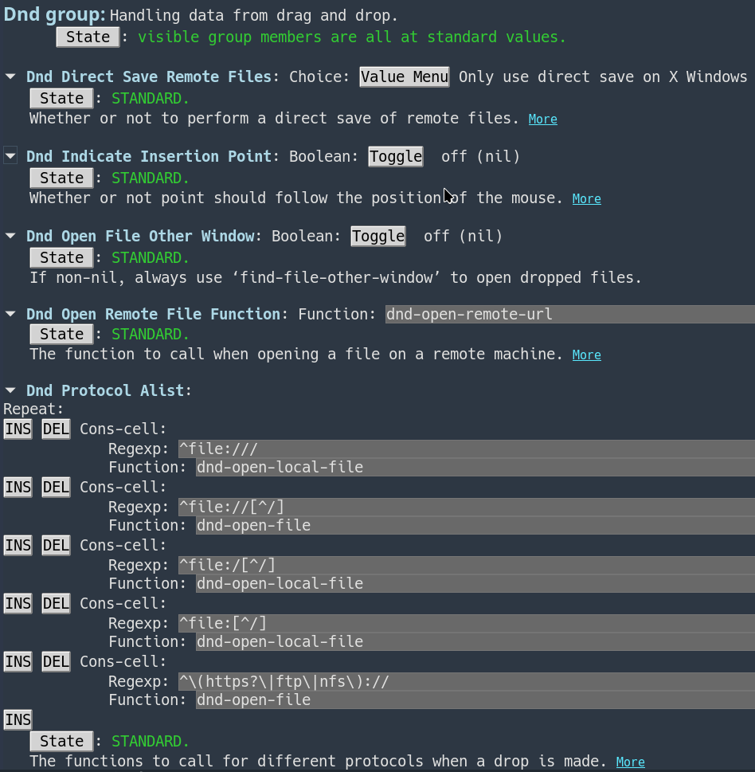
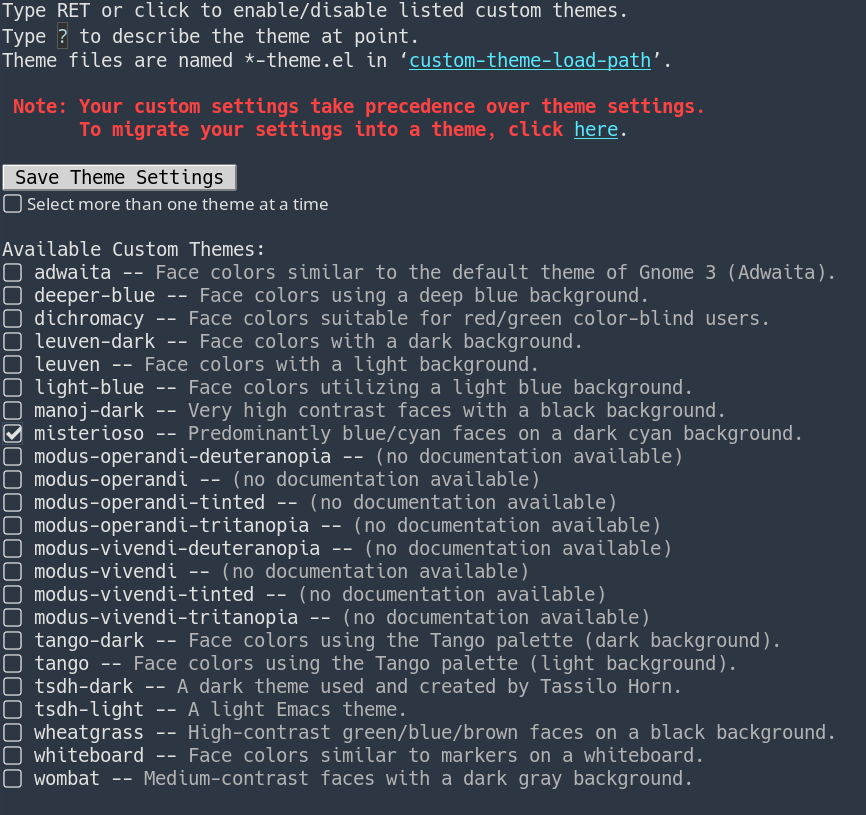
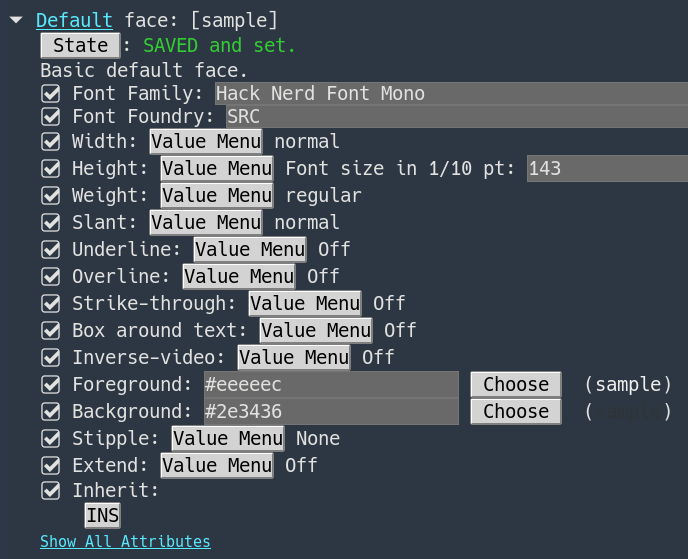
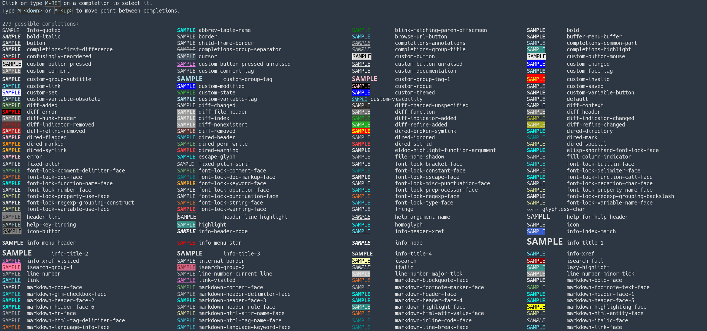

The King of Editors works remarkably well with its default settings.

The interface is well thought out, the functionality is all there, and most things are roughly where they ought to be.

Nothing left to do but use it.

And use it.

And then use it some more.

Emacs, however, also tries to be universal enough to accommodate almost any personal preference, just like other editors.

The difference is that while most applications moved two or three steps beyond the traditional preferences dialog containing five checkboxes and a dropdown menu, Emacs ran about five kilometers farther.

And it is still accelerating.

# At First Glance

Exploring a standard Emacs frame reveals an **Options** entry in the main menu.

Open it and you will find a perfectly sensible collection of commonly used settings.

You can change them.

You can save them.

Restart Emacs and, surprisingly enough, they are still there.



Simple?

Simple.

Anyone who has been paying attention during the previous episodes about the Best of All Editors should already suspect that this is far too straightforward for Emacs.

Somewhere, the real mechanism must be waiting.

Something that makes you feel alive again.

# Customize

That secret weapon is **Customize** — Emacs's universal interface for changing everything its developers explicitly marked as customizable.

Which is a very, very large portion of Emacs.

> Observation based on extensive personal research: eleven out of ten users claim that absolutely everything can be configured, while approximately 107 percent of programmers insist that it is merely _almost_ everything.

What is a setting, after all?

In greatly simplified terms, it is a named value.

So if literally everything could be configured, a hypothetical preferences dialog containing every possible option would need to be...

[several tedious calculations follow]

...well, I am not sure there are enough 4K monitors in my city.

More seriously, **Customize** approaches configuration differently.

Related settings are grouped together.

Groups contain subgroups.

Those may contain more subgroups.

The result is an enormous hierarchy that can look slightly intimidating at first, but quickly becomes logical and surprisingly easy to navigate.

Run:

```text
M-x customize
```

and Emacs creates a special buffer containing the top-level customization groups.

Its title?

> Customization of the One True Editor.

Excellent.

I need to remember that.



Among other things, the buffer contains:

- a search field,
- a **Revert...** button,
- an **Apply** button,
- an **Apply and Save** button,
- the group's title and description,
- a **State** button,
- subgroups with descriptions.

Group names are links.

They can be activated with the mouse, or by moving point onto them and pressing `RET`.

Naturally, the search field works.

And with this many settings, it rapidly becomes one of the most important parts of the entire interface.

There is one useful caveat: Customize searches settings belonging to features that have already been loaded into the current Emacs session.

## Revert

The **Revert...** button opens a menu of reset operations.

The most important ones are:

- **Undo Edits in Customization Buffer** — discard edits made in this buffer that have not yet been applied,
- **Revert This Session's Customizations** — restore values from before changes made during this session,
- **Erase Customizations** — remove saved customizations and return to standard values.

That last one becomes particularly useful after an adventurous experiment.

Which means sooner or later.

## Apply and Apply and Save

**Apply** makes all edited values in the current Customize buffer effective for the current Emacs session.

Exit Emacs and they are gone.

**Apply and Save** does the same thing, but also stores the settings for future sessions.

Under the hood, Emacs writes Lisp code representing those settings — normally into your initialization file.

You can also direct Customize output into a separate `custom-file`, which becomes increasingly attractive as the configuration grows.

We will return to that later.

## State

Individual options and groups also have their own **State** buttons.

These let you operate on a single setting rather than everything currently shown in the buffer.

Depending on its current state, the menu can contain operations such as:

- **Set for Current Session**,
- **Save for Future Sessions**,
- **Undo Edits**,
- **Revert This Session's Customizations**,
- **Erase Customization**.

So one setting can be tested temporarily, another can be saved permanently, and everything else can remain untouched.

# Going Deeper

Let us open an actual group.

For example:

```text
Environment → Dnd
```

What DND does is not important just yet.

The point is to see several different kinds of settings.

Below the search field, standard buttons, group title, and description, the actual options begin.

Some are collapsed and can be expanded with the triangle button.

For example:

- **Dnd Direct Save Remote Files** — a **Choice**,
- **Dnd Indicate Insertion Point** — a Boolean value,
- **Dnd Open Remote File Function** — a function,
- **Dnd Protocol Alist** — a list.



And this is where it becomes clear why Customize is not simply another preferences window.

## Choice

For a **Choice** value, the **Value Menu** button displays the permitted alternatives.

You do not type arbitrary text.

You select one of the values anticipated by the author of the option.

## Boolean

A Boolean setting provides a simple switch:

```text
off (nil)
```

or:

```text
on (non-nil)
```

The traditional yes-or-no question, translated into Emacs.

## Function

An option whose value is a function lets you specify the name of the function that should be used.

And here, for the first time, the shadow of Lisp appears.

Still far away.

But watching.

## List

Lists can be extended, shortened, and edited.

Buttons such as:

```text
INS
DEL
```

allow elements to be inserted or removed.

In the case of `Dnd Protocol Alist`, the value is specifically a list of pairs — an association list, or `alist`.

We will return to that word as well.

The important part is that Customize knows the type of each option.

It does not simply throw one enormous text box at the user.

It knows whether a value is Boolean, numeric, textual, a function, a choice among alternatives, or a more complex structure.

Then it builds an appropriate editing widget.

Now things are beginning to feel properly Emacs-like.

# The Shorter Route

Walking through the hierarchy is excellent when learning what Emacs can do.

It is less attractive when you already know what you want.

If you know the name of the relevant item, you can jump directly to it:

```text
M-x customize-option
M-x customize-face
M-x customize-group
```

There is also:

```text
M-x customize-apropos
```

which searches for matching settings and groups.

After a while, these commands tend to become much more common than opening `M-x customize` from the very top.

# Themes

Emacs has also provided a theme system for quite some time.

To browse available themes, use:

```text
M-x customize-themes
```

Note the plural: `customize-themes`.

A buffer containing available themes appears.

Choose one, enable it, and see what happens.



An Emacs Custom theme can affect not only colors but also option values.

Technically, a theme is simply an Emacs Lisp file containing the relevant settings.

You can even create your own:

```text
M-x customize-create-theme
```

But that is a story for another day.

# Faces

Another particularly entertaining area to experiment with is **faces**.

The simplest way to think of them is as named styles used to display text.

A face can define attributes such as:

- font family,
- size,
- weight,
- slant,
- foreground color,
- background color,
- underline.



You can enter the **Faces** group through the main Customize buffer, or jump directly to a specific one with:

```text
M-x customize-face
```

and choose the face you want to modify:



The basic face is:

```text
default
```

It provides the default appearance of displayed text, and its background color also determines the frame background.

That is usually a sensible place to begin.

But this is Emacs.

There is no requirement to begin sensibly.

Everyone is master of their own session.

And later the blacksmith of their own fate, which may become unpleasant when `2` is entered as the font size instead of `120`.

# What Next?

That is probably enough for a first encounter with configuration.

We now know that:

- Emacs has an interactive configuration interface,
- settings are arranged hierarchically,
- values have types,
- changes can be applied temporarily or saved,
- individual options, groups, and faces can be opened directly,
- Customize also handles themes.

The next step is to look under the hood.

Where exactly are these settings stored?

What lands in `init.el`?

What is `custom-file`?

And why does manual Emacs configuration sooner or later lead to the standard question:

> Which language would you choose for configuration, and why is it Lisp?

That is enough for today.

Nice?

Nice.

Easy?

Easy.

Future episodes will be even nicer.

Easier?

Well...
