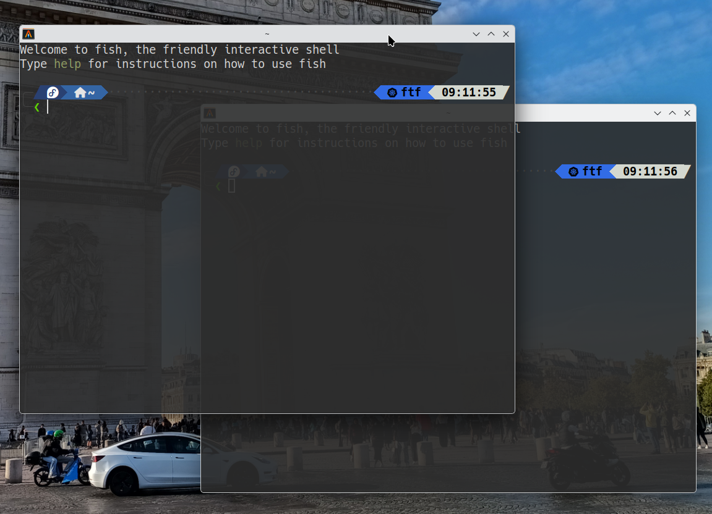
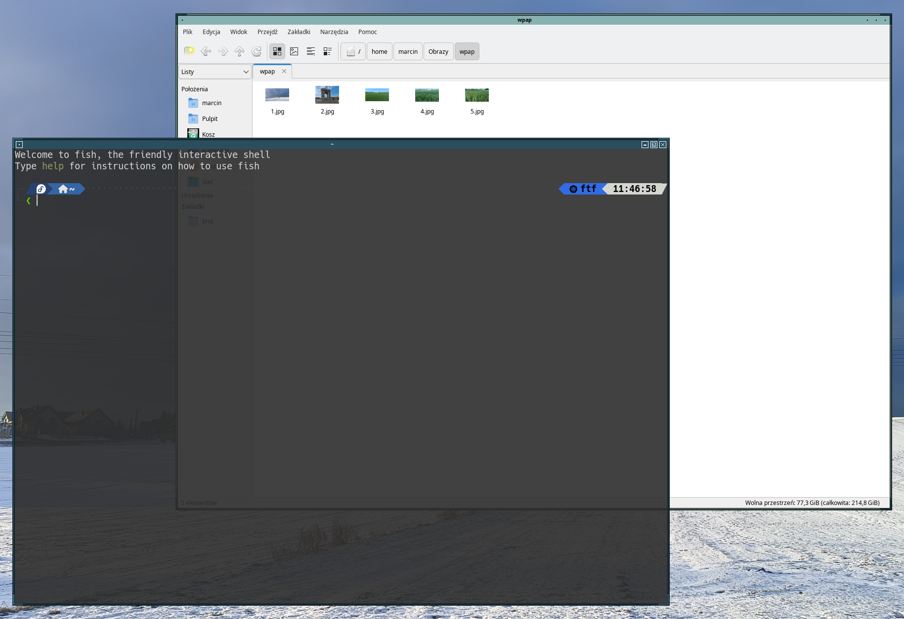
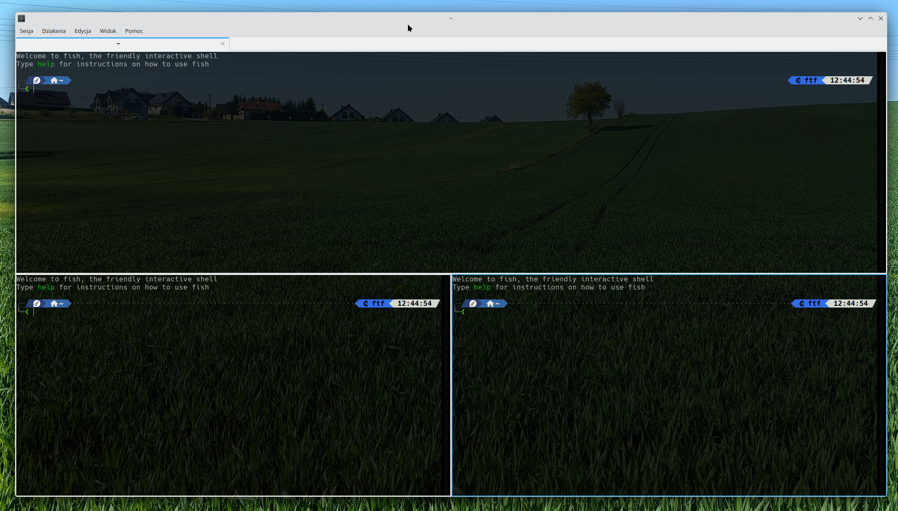
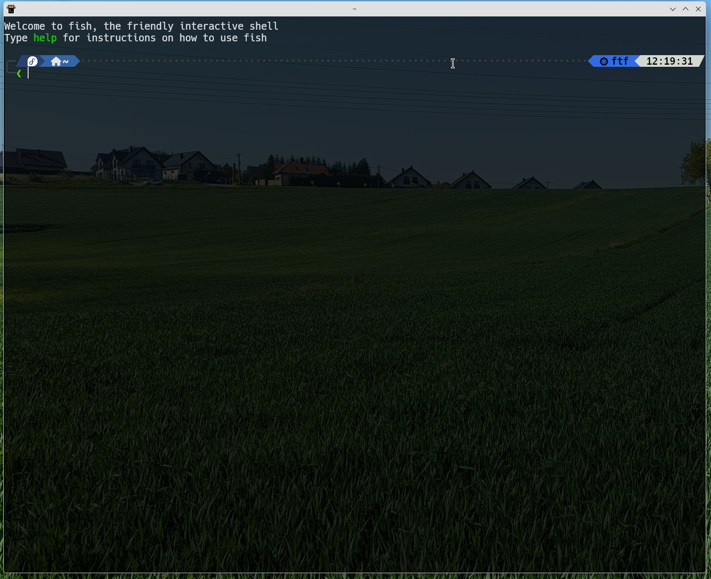
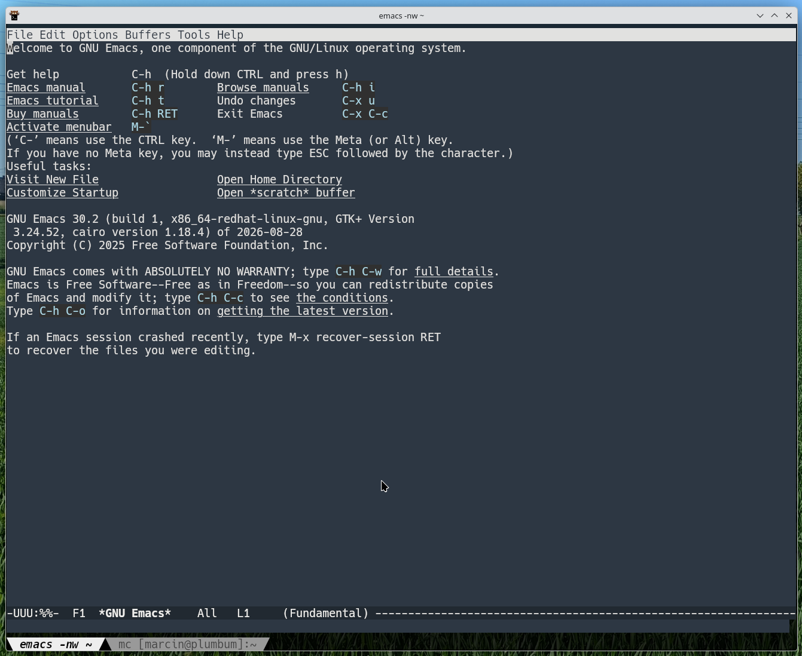
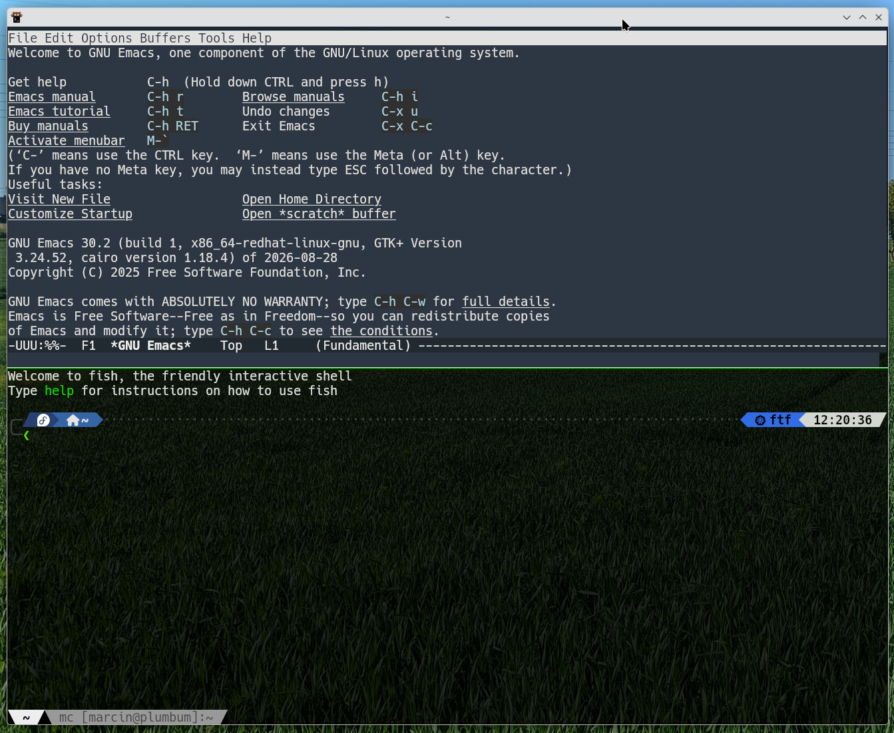
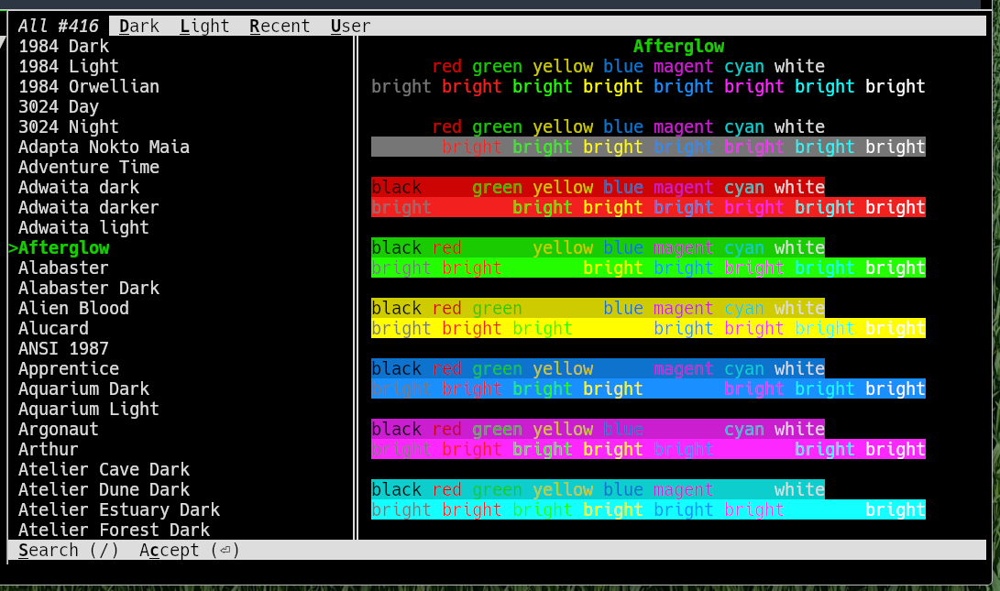

They say a real engineer chooses a text editor once and for life.

Perhaps because there are _only a few_ truly good ones.

It is a little like choosing your favorite football club: you make the decision once, and then your sons and grandsons inherit it.

They also say the same thing about your favorite shell.

They are somewhat less correct there.

About window managers?

Even less so.

And terminal emulators?

Not even remotely.

You can have several terminal emulators.

One for every occasion.

# Alacritty

The _minimal_ version of my **KDE Refugee Pack** includes `alacritty`.

Why Alacritty?

Its essential qualities are simple:

- minimalist,
- fast,
- does exactly what is required of it: opens a terminal emulator window.

It is a remarkably tidy piece of software.

Alacritty deliberately avoids becoming an all-purpose terminal application. On Linux it does not provide its own tabs or split panes; the project prefers to leave those jobs to the window manager or to a terminal multiplexer such as `tmux`.

Which, incidentally, is a perfectly reasonable idea.

Alacritty is still highly configurable and looks equally at home inside a minimalist environment or a full KDE or GNOME desktop:





It supports transparent backgrounds. Under X11 this naturally requires a compositor, so in my FVWM3 setup **picom** does the necessary work.

And, as you can see, it renders my **Tide** prompt perfectly.

A matter of the highest importance.

## Configuration

Alacritty configuration lives in:

```text
~/.config/alacritty/alacritty.toml
```

Yes.

**TOML**.

A deep bow of appreciation.

### Themes

Alacritty supports themes. A large collection of ready-made ones can be downloaded with:

```bash
mkdir -p ~/.config/alacritty/themes
git clone https://github.com/alacritty/alacritty-theme ~/.config/alacritty/themes
```

Then choose one by importing it from the configuration file:

```toml
[general]
import = [
    "~/.config/alacritty/themes/themes/afterglow.toml"
]
```

Done.

### Other Options

The rest of my configuration looks roughly like this:

```toml
[window]
opacity = 0.9
decorations = "Full"

dimensions = { columns = 120, lines = 40 }

[font]
size = 14.0

[font.normal]
family = "Hack Nerd Font"
style = "Regular"

[cursor]
style = { shape = "Beam", blinking = "On" }

[keyboard]
bindings = [
  { key = "N", mods = "Control|Shift", action = "SpawnNewInstance" },
  { key = "0", mods = "Control", action = "ResetFontSize" },
  { key = "F11", action = "ToggleMaximized" },
  { key = "F12", action = "ToggleFullscreen" },
  { key = "E", mods = "Control|Shift", command = { program = "emacs" } },
  { key = "F", mods = "Control|Shift", command = { program = "firefox" } }
]
```

One particularly useful feature is that keyboard shortcuts can invoke not only Alacritty actions but external programs as well.

The syntax is hardly mysterious.

`Ctrl+Shift+E`?

Emacs.

`Ctrl+Shift+F`?

Firefox.

Because if you can, why wouldn't you?

The remaining options are fairly self-explanatory. When in doubt, the documentation is extensive and is also available locally:

```bash
man 5 alacritty
```

One note about background blur: Alacritty also has an option such as:

```toml
blur = true
```

but in current versions it does not provide blur for an ordinary X11/FVWM3 session.

In this environment, blurring transparent windows is the compositor's responsibility — **picom**, in my case.

# QTerminal

The _standard_ version of the **KDE Refugee Pack** contains `qterminal`.

**QTerminal** is a lightweight Qt terminal emulator based on `QTermWidget`.

It is maintained by the **LXQt** project, but can be used entirely independently of the LXQt desktop.

Which is convenient.

It is lightweight, quick, and comes with a conventional graphical preferences dialog, making it ideal for anyone who occasionally still wants to click something with a mouse or change a setting using a perfectly ordinary dialog box.

Among other things, it provides:

- tabs,
- split views,
- fullscreen mode,
- profiles,
- configurable shortcuts,
- terminal background transparency.

In other words, many of the things we like about **Konsole**, without requiring the whole KDE environment.



Split views also mean that simple use cases do not necessarily require `tmux`.

I am not saying they should not use it.

I am merely saying they do not have to.

# Kitty

The _full_ version of the **KDE Refugee Pack** contains **kitty**.



**Kitty** is a terminal emulator for enthusiasts.

For people who cannot leave well enough alone and begin every second sentence with:

> I have an idea...

It is an excellent application for long autumn evenings.

Naturally only after **Emacs has been completely configured**.

So, never.

Kitty has its own extension mechanism called **kittens**. Custom kittens can be written in Python, and kitty also provides an extensive remote-control API.

Then there is the **Kitty Graphics Protocol**, which allows applications running inside the terminal to display raster graphics directly alongside text.

File managers, image previewers, and various other tools make use of it.

And, naturally:

```bash
kitten icat image.png
```

Because once you have a terminal, the obvious next requirement is displaying a cat inside it.

## Terminal Things

What about ordinary terminal-emulator features?

They are there too.

Font rendering is excellent — the **Tide** prompt looks just as good as it does in the other two.

There are extensive keyboard shortcuts.

There are **windows** — several terminal sessions can share one tab.

There are also **tabs**.

Kitty uses its own terminology:

```text
OS window
└── tab
    ├── kitty window
    ├── kitty window
    └── kitty window
```

The individual kitty windows can be arranged using several layouts, somewhat like windows inside a tiling window manager.

Interestingly, kitty does not depend on a large GUI toolkit such as GTK or Qt. It renders its interface itself using OpenGL.

As a result, the tab bar looks appropriately terminal-like.

As it should.

## Configuration

Kitty configuration lives in:

```text
~/.config/kitty/kitty.conf
```

My minimal configuration is:

```text
font_family Hack Nerd Font
font_size 14.0
background_opacity 0.9
tab_bar_style slant
```

The tab bar looks like this:



And multiple windows inside a tab look roughly like this:



This is where things start becoming interesting, because kitty provides several layouts for arranging those windows.

So it is possible to build a tiny tiling window manager...

inside a terminal emulator...

running inside a window manager.

Everything is fine.

## Themes

Kitty has a dedicated tool for choosing themes:

```bash
kitten themes
```



It opens an interactive theme browser with live previews.

You can search, browse, and switch between themes without manually rewriting color values.

After selecting a theme, kitty stores it in:

```text
~/.config/kitty/current-theme.conf
```

and adds the appropriate `include` to `kitty.conf`.

If one particular color is not quite right, there is naturally nothing stopping you from changing it manually afterward.

Of course there isn't.

# Summary

There are certainly several more unusual programs out there which, in addition to seventeen million custom features, also happen to implement a terminal emulator.

But these three should probably exhaust the subject for the next six months.

All right.

Four months.
